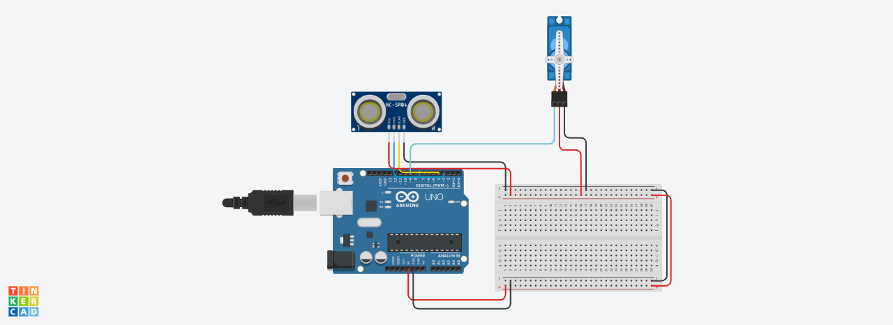

# InteligentBin
Inteligent trashcan with arduino that open automaticly when enter in his range with garbage
 

## Circuit Diagram

[Tinkercad](https://www.tinkercad.com/things/jR7JvvNQZuL)
 

## Components

- Arduino Uno (x1)
- Distance sensor (x1)
- 9V battery (x1)
- trash can(x1)
- light materieal to replace the lead with
- wood box (to put the circuit in)
- wire male to male
- wire male to female

 

## Controll

Every time our bin is on, he is ready to detect a heand close to him. If you are in the distanc elimit of the distance sensor on the top of the lead, it will open thanks to a servo motor. Then you can either wait 8 second or pass again your hand on the distance sensor in order to close it.

 

## Structure
The bin is in plastic, so it was easy to model. Afther remuving the lead I decided to just keep the ring arround and replace the top with a light plastic material. You cut at 2/3 of the lead and positioning the wood box with the curcuit inside on the shorter part. The servo, with a little rope open the longer part of the lead. The distance sensor is positioned in two holes in the lead. 
 

## Evaluation
This result in a functioning inteligent bin, that close and open when needed. You can even remove the lead and chenge the bag for the trash inside the bine like in a normal one. This because all the components are atteached to the ring of the original lead.
To be improved: Power systme and autonomy of circuit
